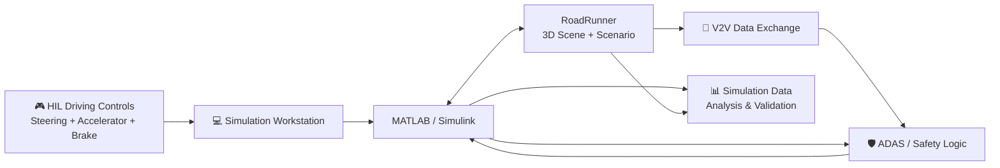

# V2V-Enabled ADAS Hardware-in-the-Loop Vehicle Simulator

<div align="center">

<a href="https://github.com/Abhishek3m4/V2V-Enabled-ADAS-Hardware-in-the-Loop-Vehicle-Simulator">
  
</a>

<p><strong>Hardware-in-the-loop automotive simulation for V2V-enabled ADAS development and testing.</strong></p>


</div>

## 🚗 Overview

A hardware-in-the-loop vehicle simulator that connects **physical driving controls** with **MATLAB/Simulink + RoadRunner** to develop and test V2V-enabled ADAS functions in a controlled virtual environment.

The project focuses on automotive control, scenario-based testing, collision avoidance and Indian-road simulation workflows without requiring a physically moving autonomous vehicle.

## ✨ Key Features

- 🎮 **Hardware-in-the-Loop** — Interface a steering wheel, accelerator and brake pedals with the simulation environment.
- 📡 **V2V Communication** — Exchange vehicle-state information for cooperative driving and safety logic.
- 🛡️ **ADAS Concepts** — Platform for functions such as AEB and vehicle safety assistance.
- 🌐 **3D Vehicle Simulation** — Build and test traffic scenarios in RoadRunner.
- 🔄 **MATLAB Integration** — Control and analyze RoadRunner simulations programmatically from MATLAB.
- 🧪 **Scenario-Based Testing** — Reproduce repeatable multi-vehicle situations for development and validation.

## 🎥 Demo / Screenshots

<div align="center">

| RoadRunner Simulation | HIL Control Setup |
|---|---|
| <!-- ADD: project RoadRunner screenshot --> | <!-- ADD: steering wheel + pedal hardware photo --> |
| *3D traffic / ego-vehicle scenario* | *Physical HIL control interface* |

| ADAS / V2V Test | MATLAB / Simulink |
|---|---|
| <!-- ADD: ADAS event screenshot/GIF --> | <!-- ADD: MATLAB/Simulink model screenshot --> |
| *Collision / safety scenario* | *Control and data-flow model* |

<!-- ADD: Demo GIF or project video link -->

</div>

## 🧩 System Architecture / Workflow



## 🛠️ Tech Stack

### Hardware


### Software & Tools


### Automotive Concepts


## 📊 Results & Highlights

| Area | Current Status |
|---|---|
| HIL driving interface | In development |
| RoadRunner 3D simulation | In development |
| MATLAB–RoadRunner control | In development |
| V2V functionality | In development |
| ADAS functions | In development |
| Quantitative benchmark | <!-- ADD: measured latency / accuracy / test count --> |

> Quantitative performance values will be added after measurement and validation.

## ✅ Requirements

- [ ] MATLAB
- [ ] Simulink
- [ ] RoadRunner
- [ ] RoadRunner Scenario
- [ ] Compatible steering-wheel + pedal controller
- [ ] Required MATLAB/Simulink interfaces for the implemented modules
- [ ] <!-- ADD: exact MATLAB/RoadRunner release -->
- [ ] <!-- ADD: additional toolbox/package dependencies -->

## 🚀 Getting Started

### 1. Clone the repository

```bash
git clone https://github.com/Abhishek3m4/V2V-Enabled-ADAS-Hardware-in-the-Loop-Vehicle-Simulator.git
cd V2V-Enabled-ADAS-Hardware-in-the-Loop-Vehicle-Simulator
```

### 2. Configure the simulation environment

Open the project in MATLAB and configure your local RoadRunner installation and project paths.

```matlab
% Example only — replace with your local paths.
rrInstallationPath = "C:\Path\To\RoadRunner\bin\win64";
rrProjectPath      = "C:\Path\To\RoadRunnerProject";
```

### 3. Connect the HIL controller

Connect the steering wheel, accelerator and brake pedals to the PC and verify that the controller is detected by the operating system.

### 4. Run the simulation

Open the relevant MATLAB/Simulink model or MATLAB control script from the repository and launch the RoadRunner scenario.

```matlab
% ADD: exact project launch script / Simulink model name
```

> **Repository status:** The public repository is currently being built out; exact runnable file names and dependency versions will be added as implementation is committed.

## 📁 Project Structure

```text
V2V-Enabled-ADAS-Hardware-in-the-Loop-Vehicle-Simulator/
├── README.md              # Project overview, workflow and setup
├── LICENSE                # MIT license
├── matlab/                # <!-- ADD: MATLAB scripts/functions -->
├── simulink/              # <!-- ADD: Simulink models -->
├── roadrunner/            # <!-- ADD: RoadRunner scenes/scenarios -->
├── hardware/              # <!-- ADD: HIL/controller integration -->
├── v2v/                   # <!-- ADD: V2V communication modules -->
├── adas/                  # <!-- ADD: ADAS logic / algorithms -->
├── results/               # <!-- ADD: logs, plots and validation results -->
└── assets/                # <!-- ADD: README screenshots/GIFs -->
```

## 🏆 Achievements / Publications

<!-- ADD only when directly applicable to this repository:
- Hackathon / competition achievement
- Award
- Publication / DOI
-->

## 👨‍💻 Author

<div align="center">

### Abhishek Ahirrao
**B.Tech E&TC | Embedded Systems • Automotive • VLSI**

<a href="https://github.com/Abhishek3m4">
  
</a>
<!-- ADD: LinkedIn URL -->
<!-- ADD: Portfolio URL -->
<a href="mailto:abhishekahirrao3m4@gmail.com">
  
</a>

</div>

## 📄 License

This project is licensed under the **MIT License**. See [LICENSE](LICENSE) for details.

---

<div align="center">

**Built for automotive simulation, ADAS development and hardware-in-the-loop testing.**

</div>
