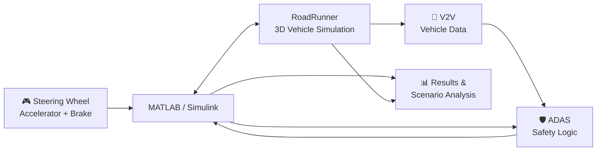

# V2V-Enabled ADAS Hardware-in-the-Loop Vehicle Simulator

<div align="center">


<strong>Hardware-in-the-loop automotive simulation for V2V-enabled ADAS development and testing.</strong>

<br><br>


</div>

---

## 🚗 Overview

A **hardware-in-the-loop vehicle simulator** that connects physical driving controls with **MATLAB/Simulink and RoadRunner** for V2V-enabled ADAS development and scenario-based testing.

The simulator provides a controlled virtual environment for vehicle control, collision-avoidance and Indian-road traffic scenarios without requiring a physically moving autonomous vehicle.

## ✨ Key Features

- 🎮 **HIL Driving Interface** — Steering wheel, accelerator and brake controls connected to the simulation.
- 📡 **V2V Communication** — Vehicle-state exchange for cooperative driving and safety functions.
- 🛡️ **ADAS Functions** — Development platform for safety concepts such as AEB.
- 🌐 **3D Simulation** — RoadRunner-based virtual vehicle and traffic scenarios.
- 🔄 **MATLAB Integration** — MATLAB/Simulink control and simulation workflow.
- 🧪 **Scenario Testing** — Repeatable multi-vehicle scenarios for testing and validation.

## 🎥 Project Demonstration

<div align="center">

| 🕹️ Hardware-in-the-Loop Setup | 🛣️ RoadRunner Highway Scenario |
|:---:|:---:|
|  |  |
| **Physical HIL control setup** | **Highway merge control scenario** |

</div>

## 🧩 System Architecture



## 🛠️ Technology Stack

| Category | Technologies |
|---|---|
| **Simulation** | MATLAB, Simulink, RoadRunner |
| **Automotive** | ADAS, AEB, V2V, Vehicle Control |
| **HIL Hardware** | Steering Wheel, Accelerator, Brake Pedals |
| **Integration** | MATLAB–RoadRunner workflow, RoadRunner API |

## 📊 Results & Highlights

| Area | Status |
|---|---|
| HIL driving controls | 🚧 In development |
| RoadRunner simulation | 🚧 In development |
| MATLAB–RoadRunner integration | 🚧 In development |
| V2V functionality | 🚧 In development |
| ADAS functionality | 🚧 In development |
| Performance metrics | <!-- ADD: verified latency / accuracy / test count --> |

> Quantitative performance values will be added after testing and validation.

## 💻 Requirements

- MATLAB
- Simulink
- RoadRunner
- RoadRunner Scenario
- Compatible steering-wheel and pedal controller
- Required MATLAB/Simulink toolboxes for implemented modules

<!-- ADD: exact MATLAB/RoadRunner versions after final environment is frozen -->

## 🚀 Getting Started

### 1. Clone

```bash
git clone https://github.com/Abhishek3m4/V2V-Enabled-ADAS-Hardware-in-the-Loop-Vehicle-Simulator.git
cd V2V-Enabled-ADAS-Hardware-in-the-Loop-Vehicle-Simulator
```

### 2. Open the project

Open the MATLAB/Simulink project and configure the local **RoadRunner installation and project path**.

### 3. Connect the HIL controller

Connect the steering wheel, accelerator and brake pedals to the PC and verify that the controller is detected.

### 4. Run the simulation

Launch the MATLAB/Simulink control workflow and the corresponding RoadRunner scenario.

```matlab
% ADD: final MATLAB launch script / Simulink model name
```

## 📁 Project Structure

```text
V2V-Enabled-ADAS-Hardware-in-the-Loop-Vehicle-Simulator/
├── assets/                 # Project screenshots and visual assets
├── matlab/                 # MATLAB scripts and functions
├── simulink/               # Simulink models
├── roadrunner/             # RoadRunner scenes and scenarios
├── hardware/               # HIL controller integration
├── v2v/                    # V2V communication modules
├── adas/                   # ADAS and safety logic
├── results/                # Simulation results and analysis
├── README.md               # Project documentation
└── LICENSE                 # MIT License
```

<!-- ADD: update the tree when the corresponding folders are committed -->

## 🏆 Achievements / Publications

<!-- ADD: project-specific award, hackathon result, publication or DOI if applicable -->

## 👨‍💻 Author

<div align="center">

### Abhishek Ahirrao

**B.Tech E&TC | Embedded Systems • Automotive • VLSI**

<a href="https://github.com/Abhishek3m4">

</a>
<a href="mailto:abhishekahirrao3m4@gmail.com">

</a>

<!-- ADD: LinkedIn -->
<!-- ADD: Portfolio -->

</div>

## 📄 License

This project is licensed under the **MIT License**. See [LICENSE](LICENSE) for details.

---

<div align="center">

**Automotive Simulation • ADAS • V2V • Hardware-in-the-Loop**

</div>
